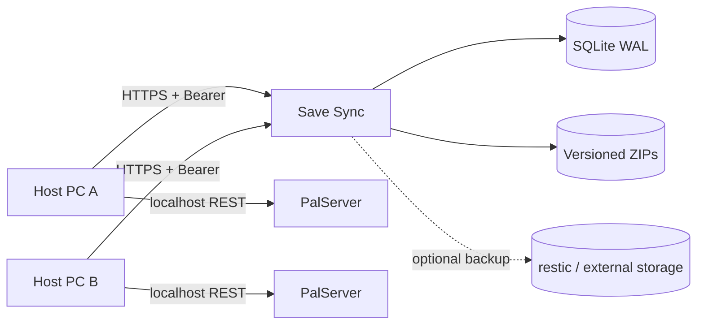

# Dedicated Server Save Sync

[](https://github.com/Ayerdi/dedicated-server-save-sync/actions/workflows/ci.yml)
[](https://github.com/Ayerdi/dedicated-server-save-sync/releases/latest)
[](LICENSE)

**Concurrency-safe save synchronization for alternating Palworld dedicated-server hosts without keeping one gaming PC online 24/7.**

> **Status:** `v2.2.1` is the stable Palworld reference implementation. This repository is in maintenance mode: bug fixes, security, dependency updates and Palworld compatibility. The broader multi-game redesign will be developed separately.

[Español](README.md) · [Website](https://ayerdi.github.io/dedicated-server-save-sync/en/) · [Wiki](https://github.com/Ayerdi/dedicated-server-save-sync/wiki) · [Releases](https://github.com/Ayerdi/dedicated-server-save-sync/releases) · [Docs](docs/INDEX.md)

> Palworld is a trademark of Pocketpair, Inc. This community project is not affiliated with, sponsored by or endorsed by Pocketpair. It does not distribute game files or save content.

## The problem

A shared ZIP, network folder or cloud directory does not establish a single authority. Two hosts can start divergent copies, timestamps can change during copying, and a perfectly valid directory may belong to another world.

Save Sync separates the game server from the authoritative save store:



The active gaming PC runs PalServer. The web service keeps the authoritative version, arbitrates the session lock, and rejects stale uploads or saves from a different world.

## Safety properties

- backend-assigned monotonically increasing integer versions;
- optimistic concurrency via `baseVersion`;
- exclusive lock with `sessionId`, TTL and heartbeat;
- adapter-defined save identity; Palworld uses `worldGuid`;
- server-side SHA-256;
- defensive ZIP validation against traversal, symlinks, entry floods and ZIP bombs;
- temporary immutable publication before moving SQLite authority;
- restore creates a **new** version instead of silently rewriting history;
- per-machine Bearer tokens stored only as hashes;
- Windows DPAPI for client-side secrets;
- configurable per-slot retention;
- durable external-backup queue supervised outside Gunicorn, with timeout, retry and audit trail;
- operational backup status without pretending a remote snapshot was checked live.

Save Sync **cannot merge divergent worlds**. If two copies were independently modified, one must be chosen explicitly.

## Recommended download

Windows hosts should download the client ZIP from the [latest release](https://github.com/Ayerdi/dedicated-server-save-sync/releases/latest). Each release also includes a `.sha256` checksum.

For production, use **the same product release** for the client and backend. The stable backend should be deployed from tag `v2.2.1`, not from the moving tip of `main`.

## Quick start

### 1. Backend

Production requirements:

- Docker Engine + Docker Compose v2;
- HTTPS;
- private filesystem storage;
- Traefik + ForwardAuth/AuthentiK for the private panel, or API-only mode.

```bash
git clone --branch v2.2.1 --depth 1 https://github.com/Ayerdi/dedicated-server-save-sync.git
cd dedicated-server-save-sync
config/deploy.sh --init-env
```

Review `.env`, then deploy:

```bash
config/deploy.sh
```

To validate the project without a reverse proxy, domain or PalServer:

```bash
bash scripts/local-e2e.sh
```

### 2. Windows client

1. Download `dedicated-server-save-sync-client-v2.2.1.zip` and its `.sha256` file from Releases.
2. Verify the checksum before extracting the archive.
3. Copy `client/config.example.json` to `client/config.json`.
4. Configure the public URL, PalServer path and `Adapter=palworld`.
5. Run `client/Configurar-secretos.cmd`.
6. Run `client/Probar-conexion.cmd`.
7. Start sessions through `client/Iniciar-PalworldSync.cmd`.

PowerShell verification example:

```powershell
$zip = 'dedicated-server-save-sync-client-v2.2.1.zip'
$expected = ((Get-Content "$zip.sha256") -split '\s+')[0].ToLowerInvariant()
$actual = (Get-FileHash $zip -Algorithm SHA256).Hash.ToLowerInvariant()
if ($actual -ne $expected) { throw 'Client SHA-256 mismatch.' }
```

Normal flow:

```text
status → lock → download if needed → start → heartbeat
→ REST save/shutdown → ZIP/SHA-256 → upload
```

The client verifies the real `worldGuid` through Palworld's local REST API before starting and before publishing. **Do not expose Palworld's REST port through your router.**

Read [client/README.md](client/README.md) and [docs/OPERATIONS.md](docs/OPERATIONS.md) before first production use.

## Backups

`SAVE_SYNC_RETENTION_PER_SLOT` limits operational versions per host/slot.

`SAVE_SYNC_POST_PUBLISH_COMMAND` defines the external backup performed after a confirmed publication, for example with `restic`. The backend enqueues the work in SQLite and a `backup-supervisor` sidecar independent from Gunicorn executes it, enforces the timeout and keeps the row for retry if the supervisor crashes. The external command must remain in the foreground and be idempotent or tolerate repeated execution.

A version with a pending backup stays protected from retention until a final result is known. Physical ZIP deletion happens only after retention metadata is committed and references are revalidated, so a crash can leave a recoverable orphan file but cannot make a rolled-back transaction point at a ZIP it already deleted.

The panel and `GET /backup-status` distinguish:

- whether automatic backups are enabled **now**;
- whether the hook for the current version completed successfully;
- active pending backups;
- stale markers;
- latest attempt and latest known success.

`latestVersionBackedUp=true` means “the hook reported success”, not “restic was queried live and the snapshot still exists”.

## Security

Never publish:

- real `.env`, `client/config.json` or `client/data/secrets.json`;
- tokens, passwords or `Authorization` headers;
- saves, ZIP archives, SQLite files, complete logs or production paths;
- real GUIDs, IPs, domains or personal names in public issues.

CI runs Ruff, pytest with an 85% coverage floor, `pip-audit`, Docker E2E —including supervisor crash/restart—, Pester and Gitleaks over Git history.

Use [SECURITY.md](SECURITY.md) for vulnerabilities. Use [GitHub Discussions](https://github.com/Ayerdi/dedicated-server-save-sync/discussions) or [issues](https://github.com/Ayerdi/dedicated-server-save-sync/issues) for non-sensitive support.

## Project scope

The backend retains generic primitives (`gameKey`, `saveIdentity`, adapters), and the repository keeps technical documentation for that design. However, **the stable public product in this repository supports Palworld**.

A broader redesign covering multi-game installations, automatic discovery, multiple server instances and a cross-platform agent is intentionally outside this repository's maintenance roadmap.

## Development

```bash
python3 -m venv .venv
. .venv/bin/activate
pip install --require-hashes -r requirements-dev.txt
ruff check save_sync tests wsgi.py
python -m pytest -q
pip-audit -r requirements.txt --progress-spinner=off
bash scripts/run-gitleaks.sh
bash scripts/local-e2e.sh
```

Windows client tests:

```powershell
Import-Module Pester -RequiredVersion 5.9.0
Invoke-Pester -Path .\client -CI
```

## Documentation

- [Documentation index](docs/INDEX.md)
- [Architecture and invariants](docs/ARCHITECTURE.md)
- [HTTP API](docs/API.md)
- [Operations](docs/OPERATIONS.md)
- [Local development](docs/LOCAL-DEVELOPMENT.md)
- [Migrations](docs/MIGRATIONS.md)
- [Multi-game design reference](docs/ADAPTING-OTHER-GAMES.md)
- [Release process](docs/RELEASES.md)
- [Public-release checklist](docs/PUBLICATION.md)
- [Security](SECURITY.md)
- [Support](SUPPORT.md)
- [Contributing](CONTRIBUTING.md)

## License

Code and documentation: [Apache License 2.0](LICENSE).
