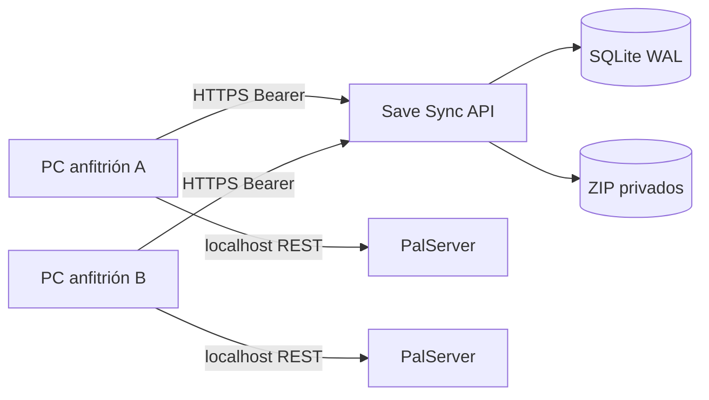

# Dedicated Server Save Sync

Motor privado para alojar alternativamente el mismo servidor dedicado en varios
ordenadores sin mantener ninguno encendido de forma permanente. Una web
disponible continuamente conserva la última copia válida, decide quién puede
alojar y evita que una partida antigua sobrescriba progreso más reciente.

Este repositorio contiene el backend Flask, el cliente Windows PowerShell, la
integración opcional con Traefik y Authentik, pruebas y procedimientos de
operación. No contiene saves, credenciales, dominios reales ni configuraciones
personales.

[English summary](README.en.md) · [Índice de documentación](docs/INDEX.md)

> Palworld es una marca de Pocketpair, Inc. Este proyecto comunitario no está
> afiliado, patrocinado ni respaldado por Pocketpair. No distribuye archivos del
> juego ni contenido de sus saves.

## El problema que resuelve

Un save compartido manualmente mediante ZIP, nube o mensajería no ofrece una
autoridad clara. Dos personas pueden iniciar copias distintas, olvidar cuál es
la última o subir accidentalmente otro mundo. Las fechas de modificación no
solucionan el problema: pueden cambiar al copiar archivos y los relojes de los
equipos no son una fuente de verdad común.

La alternativa habitual sería contratar un servidor de juego siempre activo.
Cuando eso no es posible, Save Sync separa dos responsabilidades:

- el PC activo ejecuta el servidor del juego y atiende a los jugadores;
- la web siempre disponible almacena el save y arbitra versión, mundo y lock.

La web no transporta el tráfico del juego. Solo coordina el save.

## Garantías principales

- Versión entera creciente asignada por el backend.
- Control optimista mediante `baseVersion`.
- Lock exclusivo con `sessionId`, TTL y heartbeat.
- Identidad de partida configurable; Palworld usa `worldGuid` de 32 hexadecimales.
- SHA-256 calculado de nuevo en el servidor.
- Validación ZIP, límites contra ZIP bombs y bloqueo de traversal/symlinks.
- Publicación temporal e inmutable antes de actualizar SQLite.
- Autenticación Bearer por equipo; solo se almacena el hash del token.
- Historial administrativo, restauración como versión nueva y auditoría.
- Retención por slots configurables: por ejemplo, una copia de cada anfitrión.
- Secretos del cliente cifrados con Windows DPAPI.

Ningún mecanismo puede fusionar dos mundos que hayan divergido. Si dos copias se
modifican separadamente, debe elegirse una de forma manual.

## Arquitectura



Tecnología:

- Python 3.11, Flask 3.1.3 y Gunicorn.
- SQLite WAL con transacciones `BEGIN IMMEDIATE`.
- Docker Compose.
- Traefik y Authentik para el panel privado.
- Windows PowerShell 5.1 para el cliente.

Consulta [docs/ARCHITECTURE.md](docs/ARCHITECTURE.md) para las invariantes y
[docs/API.md](docs/API.md) para el contrato HTTP completo.

## Estructura

```text
save_sync/       Backend, esquema, API y panel
client/              Cliente común para Windows
  adapters/          Integraciones específicas; Palworld es la primera
config/              Despliegue, verificación, rollback y Traefik
docs/                Arquitectura, API, operación y adaptación
tests/               Pruebas backend y concurrencia
.github/workflows/   CI Linux/Windows y detección de secretos
```

## Inicio rápido del backend

Requisitos:

- Docker Engine y Docker Compose v2.
- Una red Docker compartida con Traefik.
- Un proveedor ForwardAuth compatible con las cabeceras de Authentik.
- HTTPS público válido.

Para probar primero sin proxy ni dominio, utiliza el modo aislado descrito en
[docs/LOCAL-DEVELOPMENT.md](docs/LOCAL-DEVELOPMENT.md) o ejecuta:

```bash
bash scripts/local-e2e.sh
```

Preparación:

```bash
cp .env.example .env
chmod 600 .env
```

Edita al menos:

```text
SAVE_SYNC_GAME_KEY
SAVE_SYNC_GAME_CONFIG_PATH
SAVE_SYNC_HOST_STORAGE_PATH
SAVE_SYNC_PUBLIC_HOST
SAVE_SYNC_PUBLIC_BASE_URL
SAVE_SYNC_TRAEFIK_DYNAMIC_DIR
SAVE_SYNC_PROXY_NETWORK
SAVE_SYNC_AUTHENTIK_FORWARD_AUTH_URL
SAVE_SYNC_WEB_USERS
SAVE_SYNC_USER_IDENTITIES_JSON
```

Si `.env` todavía no existe, también puedes crearlo con secretos aleatorios:

```bash
config/deploy.sh --init-env
```

`--init-env` solo puede crear un `.env` inexistente, establece modo `0600` y
genera valores independientes para proxy y CSRF. Después revisa los valores no
secretos y despliega:

```bash
config/deploy.sh
```

El almacenamiento debe ser una ruta absoluta, privada y exterior al directorio
público de la web. El script construye el contenedor, prepara permisos, publica
la ruta dinámica de Traefik de forma atómica y ejecuta verificaciones HTTPS.

La ruta canónica queda bajo el `gameKey`:

```text
API:   https://sync.example.com/api/games/palworld
Panel: https://sync.example.com/games/palworld
```

`config/games/palworld.json` declara el nombre del juego, campo de identidad,
regex y normalización. La configuración incluida mantiene `/api/palworld` como
alias de compatibilidad, aunque los clientes nuevos usan la ruta canónica.

Para una instalación detallada y rollback, consulta
[docs/OPERATIONS.md](docs/OPERATIONS.md).

## Identidades y retención

`SAVE_SYNC_WEB_USERS` define la allowlist y los roles:

```dotenv
SAVE_SYNC_WEB_USERS=admin:admin,player:player
```

`SAVE_SYNC_USER_IDENTITIES_JSON` separa usuario técnico, nombre mostrado y slot
de retención:

```json
{
  "admin": {"displayName": "Host A", "slot": "host-a"},
  "player": {"displayName": "Host B", "slot": "host-b"}
}
```

Varios alias pueden compartir el mismo `slot`. Tras publicar correctamente, se
conserva el ZIP más reciente de cada slot configurado. La base desplegada para
un proyecto nuevo no contiene usuarios reales ni tokens activos.

Esta política es un límite deliberado de espacio: no existe una marca
`protected` que permita acumular copias adicionales. Con dos slots hay como
máximo dos ZIP canónicos, aunque ambos pueden corresponder a versiones no
consecutivas. Para conservar más historial hay que copiarlo a un sistema de
backup externo; no se debe ampliar silenciosamente el volumen operativo.

## Cliente Windows

1. Copia `client/config.example.json` como `client/config.json`.
2. Selecciona `Adapter=palworld` y ajusta las rutas de PalServer y la URL.
3. Ejecuta `client/Configurar-secretos.cmd` bajo el usuario de Windows que
   operará el servidor.
4. Ejecuta `client/Probar-conexion.cmd`.
5. Inicia las sesiones mediante `client/Iniciar-PalworldSync.cmd`.

El token web y la contraseña REST local se guardan cifrados con DPAPI y ACL
restringida en `client/data/secrets.json`. Ese archivo no puede trasladarse a
otro usuario/equipo y nunca debe versionarse.

El flujo normal es:

```text
status → lock → descarga si procede → arranque → heartbeat
→ REST save/shutdown → ZIP/SHA-256 → upload
```

El cliente verifica el `worldguid` real mediante la REST API local de Palworld
antes de permitir la sesión y antes de publicar. El puerto REST debe escuchar
solo en localhost; no debe abrirse en el router.

Más detalles y recuperación de sesiones pendientes en
[client/README.md](client/README.md).

## Adaptación a otros juegos

El backend implementa primitivas generales —versión, lock, identidad,
integridad, publicación atómica y auditoría—. El lanzador `SyncGame.ps1`
selecciona una integración bajo `client/adapters/<gameKey>`; la incluida aporta
la localización del mundo, REST save/shutdown y `worldGuid` de Palworld.

La frontera operativa es deliberada: **una instancia y un volumen por juego**.
Para añadir otro juego se crea otro JSON en `config/games/`, otro adaptador de
cliente y otro despliegue con `SAVE_SYNC_GAME_KEY`, almacenamiento y proyecto
Compose distintos. Esta separación evita que locks, restauraciones o fallos de
un título afecten a otro.

No basta con cambiar nombres. Para otro juego hay que identificar:

1. Qué conjunto de archivos forma una partida consistente.
2. Cómo ordenar un guardado y confirmar que el proceso terminó.
3. Qué identificador estable evita mezclar mundos o campañas.
4. Qué archivos temporales/backups internos deben excluirse.
5. Cómo restaurar de forma segura sin escribir mientras el servidor está vivo.

La guía y el checklist están en
[docs/ADAPTING-OTHER-GAMES.md](docs/ADAPTING-OTHER-GAMES.md).

## Desarrollo y pruebas

Backend:

```bash
python3 -m venv .venv
. .venv/bin/activate
pip install --require-hashes -r requirements-dev.txt
ruff check save_sync tests wsgi.py
python -m pytest -q
pip-audit -r requirements.txt --progress-spinner=off
```

Cliente, desde Windows PowerShell con Pester 5:

```powershell
Invoke-Pester -Path .\client -CI
```

También debe validarse:

```bash
docker compose config --quiet
docker build -t dedicated-server-save-sync:test .
bash scripts/local-e2e.sh
```

La CI ejecuta lint, cobertura mínima del 85 %, auditoría de dependencias, suite
backend, build del contenedor, E2E aislado, Pester y detección de secretos.
Consulta [SECURITY.md](SECURITY.md) antes de publicar cambios.

## Estado y límites

- El adaptador Palworld es la versión `1.2.0` e incorpora la selección preferente del
  mundo remoto cuando existen varios mundos locales.
- El backend no interpreta `Level.sav`; compara el GUID declarado por un cliente
  autenticado con la autoridad registrada.
- La carpeta del mundo es una convención usada por el cliente, no una prueba
  criptográfica del contenido.
- SQLite está pensado para una única instancia del servicio sobre almacenamiento
  local. No se admite un volumen de red ni réplicas activas del backend.
- No hay expirador periódico: los locks caducados se limpian transaccionalmente
  al acceder a las operaciones relevantes.

## Documentación

- [Arquitectura e invariantes](docs/ARCHITECTURE.md)
- [Contrato API](docs/API.md)
- [Despliegue y operación](docs/OPERATIONS.md)
- [Desarrollo local](docs/LOCAL-DEVELOPMENT.md)
- [Migraciones](docs/MIGRATIONS.md)
- [Adaptación a otros juegos](docs/ADAPTING-OTHER-GAMES.md)
- [Releases](docs/RELEASES.md)
- [Checklist de publicación](docs/PUBLICATION.md)
- [Handoff para otro agente](docs/AGENT-HANDOFF.md)
- [Seguridad](SECURITY.md)
- [Cambios](CHANGELOG.md)

## Licencia

El código y la documentación de este repositorio se distribuyen bajo la
[Apache License 2.0](LICENSE). La licencia del proyecto no concede derechos
sobre Palworld ni sobre ninguna otra marca, juego o contenido guardado.
