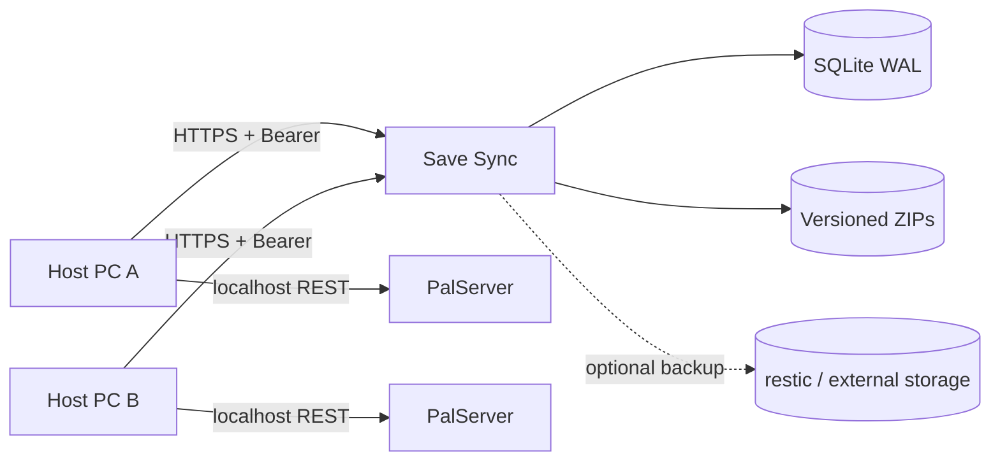

# Dedicated Server Save Sync

[](https://github.com/Ayerdi/dedicated-server-save-sync/actions/workflows/ci.yml)
[](https://github.com/Ayerdi/dedicated-server-save-sync/releases/latest)
[](LICENSE)
[](https://github.com/Ayerdi/dedicated-server-save-sync/actions/workflows/pages.yml)

**Concurrency-safe save synchronization for alternating Palworld dedicated-server hosts without keeping one gaming PC online 24/7.**

> **Status:** `v2.2.2` is the stable Palworld reference release. This repository is in maintenance mode: bug fixes, security updates, dependency maintenance, documentation and Palworld compatibility. The broader multi-game / device-sync product will be developed separately.

> **Development note:** the current development tree contains an experimental Valheim 1.0 Windows adapter. It reuses the generic backend contract but is not part of the `v2.2.2` stable release and should not be used on the only copy of a real world before its two-host acceptance test passes.

[Website](https://ayerdi.github.io/dedicated-server-save-sync/) · [Wiki](https://github.com/Ayerdi/dedicated-server-save-sync/wiki) · [Docs](docs/INDEX.md) · [Releases](https://github.com/Ayerdi/dedicated-server-save-sync/releases) · [Discussions](https://github.com/Ayerdi/dedicated-server-save-sync/discussions)

> **Spanish documentation:** the repository itself is maintained in English. The [Wiki](https://github.com/Ayerdi/dedicated-server-save-sync/wiki) keeps a complete Spanish section alongside the English pages.

> Palworld is a trademark of Pocketpair, Inc. This community project is not affiliated with, sponsored by or endorsed by Pocketpair. It does not distribute game files or save content.

## The problem

A shared ZIP, network folder or cloud directory does not establish a single source of truth. Two hosts can start divergent copies, timestamps can change while files are copied, and a perfectly valid directory may belong to a different world.

Save Sync separates the game server from the authoritative save store:



The active gaming PC runs PalServer. Save Sync keeps the authoritative version, arbitrates the session lock and rejects stale uploads or saves from another world.

## Safety properties

- backend-assigned monotonically increasing integer versions;
- optimistic concurrency through `baseVersion`;
- exclusive lock with `sessionId`, TTL and heartbeat;
- adapter-defined save identity; Palworld uses `worldGuid`;
- server-side SHA-256 verification;
- defensive ZIP validation against path traversal, symlinks, entry floods and ZIP bombs;
- immutable publication before SQLite moves the authoritative pointer;
- restore creates a **new** version instead of rewriting history;
- per-machine Bearer tokens stored only as hashes;
- Windows DPAPI for client-side secrets;
- configurable per-slot retention;
- durable external-backup queue supervised outside Gunicorn, with timeout, retry and audit trail;
- backup status that reports what is actually known instead of pretending a remote snapshot was checked live.

Save Sync **does not merge divergent worlds**. If two copies were independently modified, one must be chosen explicitly.

## Recommended installation

For production, use **the same product release** for the client and backend. Do not deploy the moving tip of `main` on a real world.

### 1. Backend

Requirements:

- Docker Engine + Docker Compose v2;
- HTTPS;
- private filesystem storage;
- Traefik + ForwardAuth/AuthentiK for the private panel, or API-only mode.

```bash
git clone --branch v2.2.2 --depth 1 https://github.com/Ayerdi/dedicated-server-save-sync.git
cd dedicated-server-save-sync
config/deploy.sh --init-env
```

Review `.env`, then deploy:

```bash
config/deploy.sh
```

To validate the stack locally without a reverse proxy, domain or PalServer:

```bash
bash scripts/local-e2e.sh
```

### 2. Windows client

1. Download `dedicated-server-save-sync-client-v2.2.2.zip` and its `.sha256` file from [Releases](https://github.com/Ayerdi/dedicated-server-save-sync/releases/latest).
2. Verify the checksum before extracting the archive.
3. Copy `client/config.example.json` to `client/config.json`.
4. Configure the public URL, PalServer path and `Adapter=palworld`.
5. Run `client/Configure-Secrets.cmd`.
6. Run `client/Test-Connection.cmd`.
7. Start sessions through `client/Start-PalworldSync.cmd`.

The older Spanish command filenames remain in the package as compatibility aliases, so existing installations and scripts do not break.

PowerShell checksum verification:

```powershell
$zip = 'dedicated-server-save-sync-client-v2.2.2.zip'
$expected = ((Get-Content "$zip.sha256") -split '\s+')[0].ToLowerInvariant()
$actual = (Get-FileHash $zip -Algorithm SHA256).Hash.ToLowerInvariant()
if ($actual -ne $expected) { throw 'Client SHA-256 mismatch.' }
```

Normal session flow:

```text
status → lock → download if needed → start → heartbeat
→ REST save/shutdown → ZIP/SHA-256 → upload
```

The client verifies the real `worldGuid` through Palworld's local REST API before starting and before publishing. **Do not expose Palworld's REST port through your router.**

Read [client/README.md](client/README.md) and [docs/OPERATIONS.md](docs/OPERATIONS.md) before first production use.

## Durable backups

`SAVE_SYNC_RETENTION_PER_SLOT` limits operational versions per host/slot.

`SAVE_SYNC_POST_PUBLISH_COMMAND` defines an external backup after a confirmed publication. The web process only queues the work in SQLite; a separate `backup-supervisor` service executes it, applies the timeout, audits the result and retains the row for retry if the supervisor crashes before recording a final outcome.

A version with a pending backup stays protected from retention. Physical ZIP deletion occurs only after retention metadata is committed and current references are revalidated.

`GET /backup-status` and the panel distinguish current backup configuration from historical results. `latestVersionBackedUp=true` means the configured hook reported success for the current version; it does **not** mean the restic repository was queried live.

## Security

Never publish real `.env`, client configuration/secrets, tokens, passwords, saves, ZIP archives, SQLite databases, complete logs, production paths, GUIDs, IPs, domains or personal names.

CI runs Ruff, pytest with an 85% coverage floor, `pip-audit`, Docker E2E —including supervisor crash/restart—, Pester and Gitleaks over Git history.

Use [SECURITY.md](SECURITY.md) for vulnerabilities. Use [GitHub Discussions](https://github.com/Ayerdi/dedicated-server-save-sync/discussions) or [issues](https://github.com/Ayerdi/dedicated-server-save-sync/issues) for non-sensitive support.

## Project scope

The backend retains generic primitives (`gameKey`, `saveIdentity`, adapters), and the repository keeps technical documentation for that design. However, **the stable product in this repository supports Palworld**.

An experimental Valheim adapter is developed behind the same isolation boundary: it requires its own `gameKey`, database and storage root and does not change Palworld's legacy API/REST behavior.

A broader product covering multi-game installations, automatic save discovery, multiple server instances, device-to-device cloud save synchronization and a cross-platform agent is intentionally outside this repository's maintenance scope.

## Development

```bash
python3 -m venv .venv
. .venv/bin/activate
pip install --require-hashes -r requirements-dev.txt
bash -n scripts/*.sh config/*.sh
ruff check save_sync tests wsgi.py scripts/check-docs.py
python scripts/check-docs.py
python -m pytest -q
pip-audit -r requirements.txt --progress-spinner=off
docker compose config --quiet
bash scripts/run-gitleaks.sh
bash scripts/local-e2e.sh
```

Windows client tests:

```powershell
Import-Module Pester -RequiredVersion 5.9.0
Invoke-Pester -Path .\client -CI
```

## Documentation

- [Documentation index](docs/INDEX.md)
- [Architecture and invariants](docs/ARCHITECTURE.md)
- [HTTP API](docs/API.md)
- [Operations](docs/OPERATIONS.md)
- [Local development](docs/LOCAL-DEVELOPMENT.md)
- [Migrations](docs/MIGRATIONS.md)
- [Multi-game design reference](docs/ADAPTING-OTHER-GAMES.md)
- [Release process](docs/RELEASES.md)
- [Publication checklist](docs/PUBLICATION.md)
- [Maintainer guide](docs/AGENT-HANDOFF.md)
- [Security](SECURITY.md)
- [Support](SUPPORT.md)
- [Contributing](CONTRIBUTING.md)

## License

Code and documentation: [Apache License 2.0](LICENSE).
