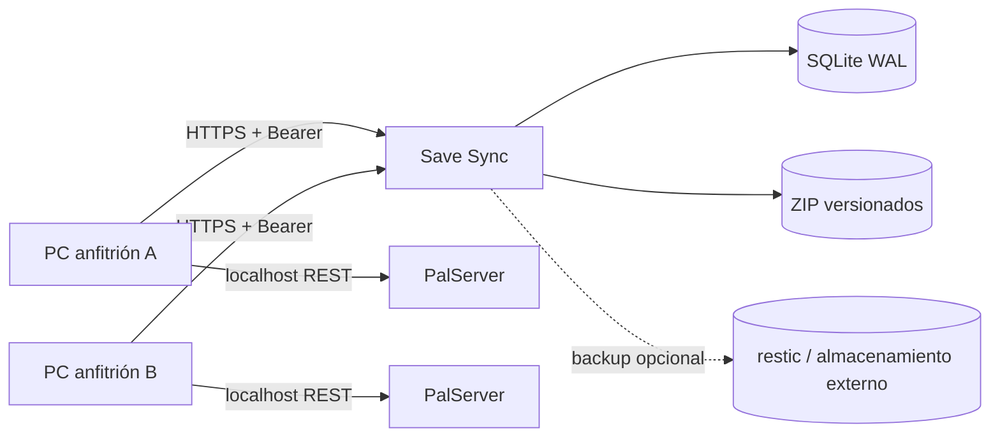

# Dedicated Server Save Sync

[](https://github.com/Ayerdi/dedicated-server-save-sync/actions/workflows/ci.yml)
[](https://github.com/Ayerdi/dedicated-server-save-sync/releases/latest)
[](LICENSE)

**Sincronización segura de partidas para alojar alternativamente un servidor dedicado de Palworld en varios PCs sin mantener uno encendido 24/7.**

> **Estado:** `v2.2.0` es la referencia estable de Palworld. Este repositorio entra en mantenimiento: correcciones, seguridad, dependencias y compatibilidad con Palworld. La evolución multi-juego se desarrollará por separado.

[English](README.en.md) · [Web](https://ayerdi.github.io/dedicated-server-save-sync/) · [Wiki](https://github.com/Ayerdi/dedicated-server-save-sync/wiki) · [Releases](https://github.com/Ayerdi/dedicated-server-save-sync/releases) · [Documentación](docs/INDEX.md)

> Palworld es una marca de Pocketpair, Inc. Este proyecto comunitario no está afiliado, patrocinado ni respaldado por Pocketpair. No distribuye archivos del juego ni contenido de sus saves.

## Qué problema resuelve

Compartir manualmente un ZIP, una carpeta de red o un directorio de nube no crea una autoridad común. Dos hosts pueden arrancar copias distintas, una fecha de modificación puede cambiar al copiar y una carpeta perfectamente válida puede pertenecer a otro mundo.

Save Sync separa el servidor de juego del almacenamiento autoritativo:



El PC que juega ejecuta PalServer. La web conserva la versión válida, arbitra el lock y rechaza uploads obsoletos o pertenecientes a otro mundo.

## Garantías principales

- versión entera creciente asignada por el backend;
- control optimista mediante `baseVersion`;
- lock exclusivo con `sessionId`, TTL y heartbeat;
- identidad de partida (`saveIdentity`); Palworld usa `worldGuid`;
- SHA-256 recalculado en servidor;
- ZIP defensivo contra traversal, symlinks, exceso de entradas y ZIP bombs;
- publicación temporal e inmutable antes de mover la autoridad en SQLite;
- restauración como **nueva** versión, nunca reescritura silenciosa;
- tokens Bearer por equipo almacenados únicamente como hashes;
- secretos locales cifrados con Windows DPAPI;
- retención configurable por slot;
- hook de backup externo con timeout y auditoría;
- panel con estado observable del backup sin fingir que un snapshot remoto sigue existiendo.

Save Sync **no fusiona mundos divergentes**. Si dos copias fueron modificadas de forma independiente, hay que elegir una de manera explícita.

## Descarga recomendada

La forma más cómoda para el PC Windows es descargar el ZIP del cliente desde la [última release](https://github.com/Ayerdi/dedicated-server-save-sync/releases/latest). Cada release publica también un archivo `.sha256`.

El backend se despliega desde el commit etiquetado usando Docker Compose y dependencias bloqueadas por hash.

## Inicio rápido

### 1. Backend

Requisitos de producción:

- Docker Engine + Docker Compose v2;
- HTTPS;
- una ruta privada de almacenamiento;
- Traefik + ForwardAuth/AuthentiK para el panel, o modo API-only.

```bash
git clone https://github.com/Ayerdi/dedicated-server-save-sync.git
cd dedicated-server-save-sync
config/deploy.sh --init-env
```

Revisa `.env` y despliega:

```bash
config/deploy.sh
```

Para validar el proyecto sin proxy, dominio ni PalServer:

```bash
bash scripts/local-e2e.sh
```

### 2. Cliente Windows

1. Descarga y extrae `dedicated-server-save-sync-client-v2.2.0.zip`.
2. Copia `client/config.example.json` a `client/config.json`.
3. Configura la URL pública, la ruta de PalServer y `Adapter=palworld`.
4. Ejecuta `client/Configurar-secretos.cmd`.
5. Ejecuta `client/Probar-conexion.cmd`.
6. Inicia con `client/Iniciar-PalworldSync.cmd`.

El flujo normal es:

```text
status → lock → descarga si procede → arranque → heartbeat
→ save/shutdown REST → ZIP/SHA-256 → upload
```

El cliente comprueba el `worldGuid` real mediante la REST local de Palworld antes de permitir una sesión y antes de publicar. **No abras el puerto REST de Palworld en el router**.

Consulta [client/README.md](client/README.md) y [docs/OPERATIONS.md](docs/OPERATIONS.md) antes del primer uso real.

## Backups

`SAVE_SYNC_RETENTION_PER_SLOT` limita cuántas versiones operativas se conservan por host/slot.

`SAVE_SYNC_POST_PUBLISH_COMMAND` permite lanzar un backup externo después de una publicación confirmada, por ejemplo con `restic`. El hook no puede convertir un upload ya confirmado en error: su resultado se audita por separado.

El panel y `GET /backup-status` distinguen:

- si el backup automático está habilitado **ahora**;
- si el hook de la versión actual terminó correctamente;
- pendientes activos;
- markers vencidos;
- último intento y último éxito conocido.

`latestVersionBackedUp=true` significa “el hook confirmó éxito”, no “se acaba de consultar restic y el snapshot continúa disponible”.

## Seguridad

No publiques nunca:

- `.env`, `client/config.json` o `client/data/secrets.json`;
- tokens, contraseñas o cabeceras `Authorization`;
- saves, ZIP, SQLite, logs completos ni rutas de producción;
- GUID, IP, dominio o nombres personales reales cuando abras una incidencia.

El repositorio ejecuta Ruff, pytest con cobertura mínima del 85 %, `pip-audit`, Docker E2E, Pester y Gitleaks sobre el historial Git.

Para vulnerabilidades usa [SECURITY.md](SECURITY.md). Para soporte no sensible usa [GitHub Discussions](https://github.com/Ayerdi/dedicated-server-save-sync/discussions) o las [incidencias](https://github.com/Ayerdi/dedicated-server-save-sync/issues).

## Alcance del proyecto

El backend ya contiene primitivas genéricas (`gameKey`, `saveIdentity`, adaptadores), y se conserva documentación sobre cómo estudiar otros juegos. Sin embargo, **la versión pública estable de este repositorio se considera la implementación de referencia de Palworld**.

Los rediseños que impliquen instalación multi-juego, discovery automático, múltiples instancias de servidor o un agente multiplataforma no forman parte del roadmap de mantenimiento de este repositorio.

## Desarrollo

```bash
python3 -m venv .venv
. .venv/bin/activate
pip install --require-hashes -r requirements-dev.txt
ruff check save_sync tests wsgi.py
python -m pytest -q
pip-audit -r requirements.txt --progress-spinner=off
bash scripts/run-gitleaks.sh
bash scripts/local-e2e.sh
```

En Windows:

```powershell
Import-Module Pester -RequiredVersion 5.9.0
Invoke-Pester -Path .\client -CI
```

## Documentación

- [Índice](docs/INDEX.md)
- [Arquitectura e invariantes](docs/ARCHITECTURE.md)
- [Contrato HTTP](docs/API.md)
- [Despliegue y operación](docs/OPERATIONS.md)
- [Desarrollo local](docs/LOCAL-DEVELOPMENT.md)
- [Migraciones](docs/MIGRATIONS.md)
- [Adaptación a otros juegos](docs/ADAPTING-OTHER-GAMES.md)
- [Releases](docs/RELEASES.md)
- [Checklist de publicación](docs/PUBLICATION.md)
- [Seguridad](SECURITY.md)
- [Soporte](SUPPORT.md)
- [Contribuir](CONTRIBUTING.md)

## Licencia

Código y documentación: [Apache License 2.0](LICENSE).
